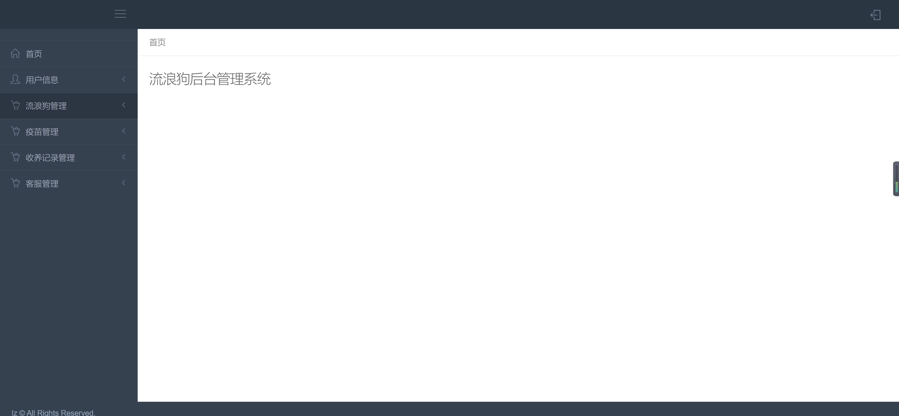
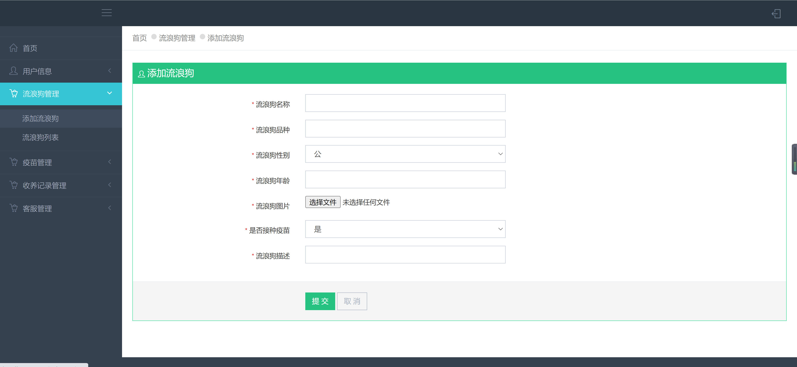

<h1 align="center">流浪动物管理系统</h1>

## 简介
流浪动物管理系统：角色分为管理员、用户；主要功能包括流浪动物信息管理、疫苗管理、收养记录、用户留言互动和文章推荐等，以优化流浪动物的收养和管理过程。    --计算机毕业设计源码；毕设源码；java毕业设计源码

## 联系方式

<h3 align="center">获取完整代码与数据库文件 + 微信：deepguan QQ: 86050149 QQ群: 783742310</h3>

<h3 align="center">可帮忙远程部署 包运行成功！提供远程部署、修改代码、设计文档指导、代码讲解等服务！</h3>

## 功能介绍（完整见运行截图）
管理员：基本功能包括用户创建、信息录入、查看和更新，以及系统登录和退出。首页通过导航栏访问流浪狗管理、疫苗记录、收养记录及客服模块。流浪狗信息管理涵盖添加、编辑、接种状态更新及删除。用户互动功能支持用户留言查看，增强社区交流。

用户：可以通过登录界面进入系统，访问个人中心查看和编辑个人信息。用户能够浏览和管理流浪狗的详细信息，包括查看接种和领养状态。社区功能允许用户发表留言和互动，增进用户间的沟通和平台参与感。

## 运行截图

本代码来源于网络,仅供学习参考使用!

